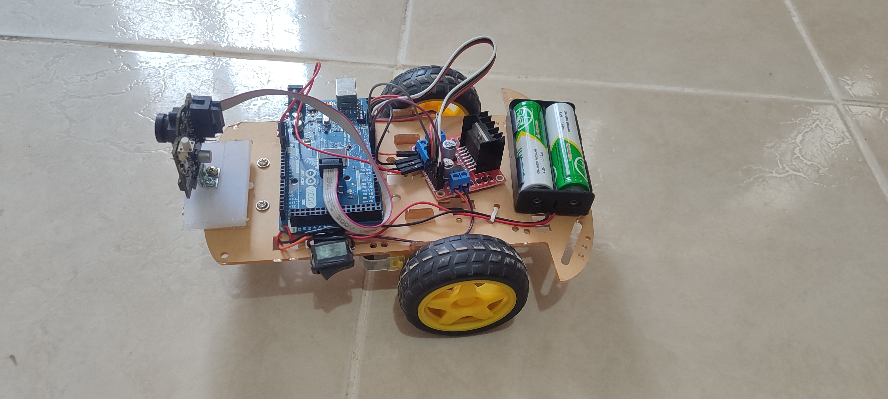

# Carro + PixyCam (Detección de Color)

## Construcción

## Demostración

## Componentes

### Kit Chasis de 2 ruedas para Carrito Robot
- 2x Motores DC con reducción
- 2x Ruedas de goma (6.5 x 2.7 cm)
- 1x Rueda loca
- 1x Portapilas para 2 pilas AA
- 2x Encoders
- 4x Sujetadores de motor
- Tornillos y tuercas M3
- 4x Espaciadores M3
- 1x Chasis de acrílico (aprox. 20 x 14 cm)
- 2 pilas AA

### Módulos
- Arduino UNO R3 ATMEGA 328P con cable USB
- Controlador de motor dual L298N (Puente H)
- Pixy2 Smart Vision Sensor: Cámara de seguimiento de objetos compatible con Arduino, Raspberry Pi y BeagleBone Black

### Otros
- Interruptor pequeño a presión (10x15 mm, 2 pines, 250V, On/Off)
- Cables jumper (10 cm, M-M / M-H / H-H)