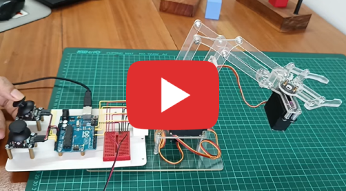
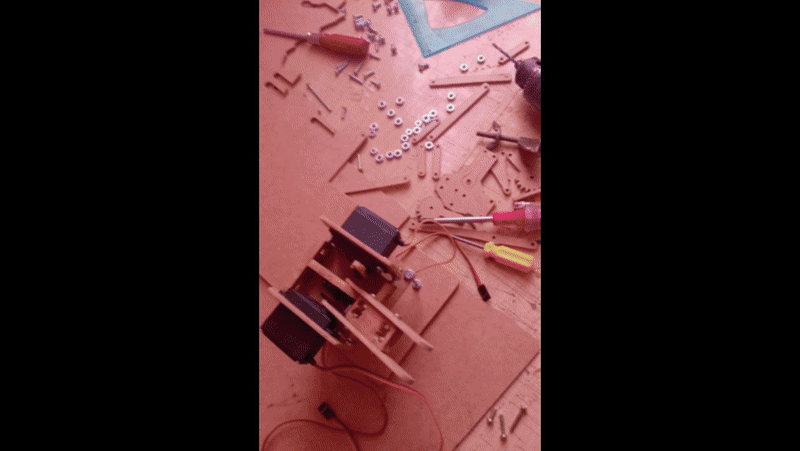

<h1 align="center">🤖 Brazo Robot</h1>

<p align="center">
    
</p>

## 📖 Descripción
<p>Este proyecto de robótica se enfoca en la construcción e implementación de un brazo robótico inteligente. El sistema utiliza una cámara integrada para capturar imágenes en tiempo real, permitiendo identificar objetos basándose en su color RGB mediante procesamiento de imágenes realizado en una Raspberry Pi.

Una vez que el objeto ha sido identificado, se analiza su posición espacial (izquierda, centro o derecha) en el entorno de trabajo. Posteriormente, el sistema calcula y ejecuta la rotación de los servomotores para posicionar correctamente el brazo y proceder con el levantamiento preciso del objeto.</p>

## 📚 Materiales
- lista
- lista
- lista1
- lista1

## 🔗 Enlaces De Referencia
<p>
  ⬇ <a href="./assets/plano.pdf" target="_blank">Archivo PDF de diseño</a>
</p>

(Video) Construcción del brazo<br>

<p align="center">
    <a href="https://www.youtube.com/watch?v=7t7-bZ4KnVc">
        
    </a>
</p>

<p align="center">
    
</p>

## 🧾 Requisitos de raspberry
- python 10+

## ✨ Cómo usar
Sigue estos pasos para ejecutar la aplicación:

1. Clona el repositorio ejecutando el siguiente comando:
    ```bash
    $ git clone https://github.com/CesarMiranda01/COM520_Robotics_2/tree/main/4.arm_raspberry
    ```
2. Ingresa a la carpeta ejecutando el siguiente comando:
    ```bash
    $ cd 4.arm_raspberry
    ```
3. Instala las dependencias necesarias ejecutando el siguiente comando:
    ```bash
    $ pip install -r requirements.txt
    ```
4. Inicia la aplicación con:
    ```bash
    $ python app.py
    ```
5. Debido a que la inclinación del brazo tiene límites de distancia, es necesario establecer las posiciones para izquierda, centro y derecha. Esto permitirá ubicar el objeto en uno de los puntos y garantizar que el brazo proceda a levantarlo correctamente.

6. Enfoca el área de trabajo con la cámara sobre el brazo robótico. Asegúrate de que el objeto esté visible.

7. Una vez que el área esté correctamente enfocada, presiona la tecla 'a' para que el brazo proceda a detectar, ubicar y levantar el objeto identificado.

## 🦾 Resultado
<p align="center">
    
</p>
