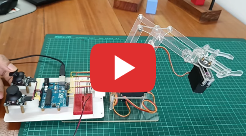
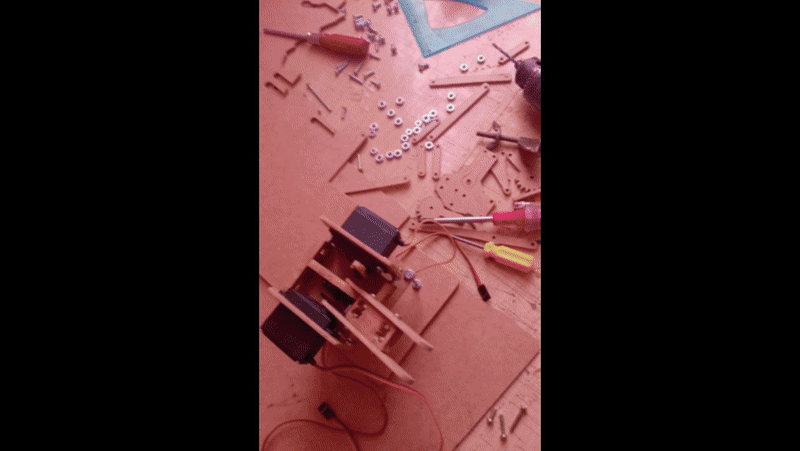

<h1 align="center">🤖 Robotic Arm with Computer Vision</h1>

<p align="center">
    
</p>

## 📖 Project Overview

This robotics project focuses on building and implementing an intelligent robotic arm system. The system integrates a camera for real-time image capture, enabling color-based object detection using RGB processing on a Raspberry Pi.

Once an object is identified, the system analyzes its spatial position (left, center, or right) within the workspace. The system then calculates and executes precise servo motor rotations to position the arm correctly and perform accurate object lifting operations.

## 🎯 Key Features

- **Real-time color detection** using computer vision
- **Precise servo control** with smooth movement algorithms
- **Position-based object manipulation** (left/center/right)
- **Automated pick-and-place operations**
- **Raspberry Pi integration** for embedded control

## 🛠️ Hardware Components

### Electronics
- **Raspberry Pi** (any model with GPIO pins)
- **Webcam** (USB compatible)
- **MG995 Servo Motors** (4 units)
- **Adjustable power supply** (voltage and current regulated)
- **Protoboard** for connections
- **Jumper wires** (10cm M-M, M-F, F-F)

### Mechanical Components
- **Trupan/MDF boards** (60cm x 60cm, 3mm and 5mm thickness)
- **Saw** for cutting trupan
- **Drill** with 3mm wood drill bit
- **M3 Screws**:
  - 50mm length (5 units)
  - 18mm length (5 units)
  - 15mm length (5 units)
  - 12mm length (6 units)
  - 10mm length (14 units)
- **3mm nuts**

## 📚 Reference Materials

### Design Files
⬇ [Download PDF Design Plans](./assets/plano.pdf)

### Video Tutorial
<p align="center">
    <a href="https://www.youtube.com/watch?v=7t7-bZ4KnVc" target="_blank">
        
    </a>
</p>

<p align="center">
    
</p>

## ⚙️ System Requirements

- **Raspberry Pi** with Raspberry Pi OS
- **Python 3.10+**
- **OpenCV** for computer vision
- **RPi.GPIO** for servo control

## 🚀 Installation & Setup

### 1. Clone the Repository
```bash
git clone https://github.com/CesarMiranda01/COM520_Robotics_2.git
cd COM520_Robotics_2/4.arm_raspberry