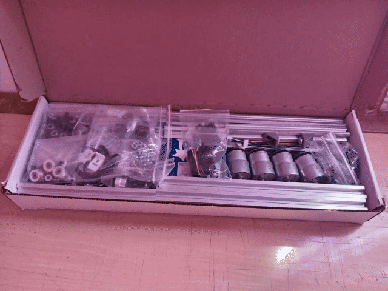
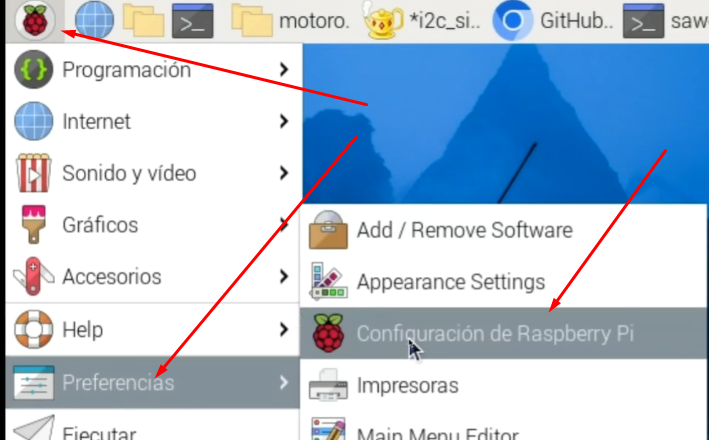

# 🚗 Robot Controlled with Motoron, DC Motors and Raspberry Pi

This project involves building a small robotic car controlled by a **Raspberry Pi** and Pololu's **Motoron** motor controller. It uses DC motors for movement and can be programmed to operate autonomously or be controlled remotely.

## 📦 Materials
- 1 × Raspberry Pi
- 2 × Motoron motor controllers
- 4 × DC motors compatible with Motoron
- 1 × Car chassis
- 4 × Wheels compatible with the motors
- 1 × Battery or power supply for motors
- Jumper wires
- Screws and fasteners

<p align="center">
    
</p>

## 🔧 Raspberry Pi Setup for Motoron

1. **Connecting Motoron to Raspberry Pi**
To connect the Motoron controller (such as M3H256 or M2H) to the Raspberry Pi:
- GND: Connect to GND pin of Raspberry Pi
- VIN: Connect to motor power supply
- M3A/M3B, M2A/M2B: Connect motors to these pins
- SDA: Connect to GPIO pin 2 (SDA)
- SCL: Connect to GPIO pin 3 (SCL)
- 3V3 or IOREF: Connect to 3.3V pin

2. **Enable I2C Interface on Raspberry Pi**
- Enter Raspberry Pi configuration
- Enable I2C interface
- Save changes and restart

<p align="center">
    
</p>

<p align="center">
    
</p>

3. **Verify Motoron Connection:**
```bash
i2cdetect -y 1
```
<p align="center">
    
</p>

4. Change Motoron I2C Address (optional)

* Prepare the device:
    - Make sure the JMP1 pin is not connected.
    - Temporarily connect JMP1 to GND to select the device.
    - Install the Motoron library: (Check the official Pololu repository)

    - Run the configuration script (https://github.com/pololu/motoron-python/blob/master/i2c_set_addresses_example.py):
    ```bash
    python3 set_i2c_addresses_example.py
    ```
    - For example, to assign address 17:
    ```bash
    a17
    ```
    - Disconnect JMP1 from GND and restart: You can do this from the script (r) or restart your Raspberry Pi.
    - Confirm the assigned address:
    ```bash
    i2cdetect -y 1
    ```

## 🔗 Reference Links

- [Section 3.2.4 - Using Motoron with Raspberry Pi (I2C Configuration)](https://www.pololu.com/docs/0J84/3.2.4)
- [Section 3.3 - Software Setup on Raspberry Pi](https://www.pololu.com/docs/0J84/3.3)
- [Section 3.4 - Python Example Code](https://www.pololu.com/docs/0J84/3.4)
- [Motoron Controller Main Page](https://www.pololu.com/product/5033)
- [Official pololu-motoron-python Repository](https://github.com/pololu/motoron-python/tree/master)

## ⚙️ How to Use

```bash
# Clone the repository
git clone https://github.com/CesarMiranda01/COM520_Robotics_2/tree/main/6.pololu-motoron

# Access project
cd pololu-motoron

# Run the script
python app.py

## 🚗 Resultado
<p align="center">
    
</p>
