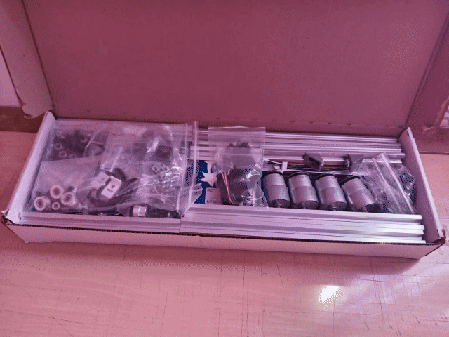
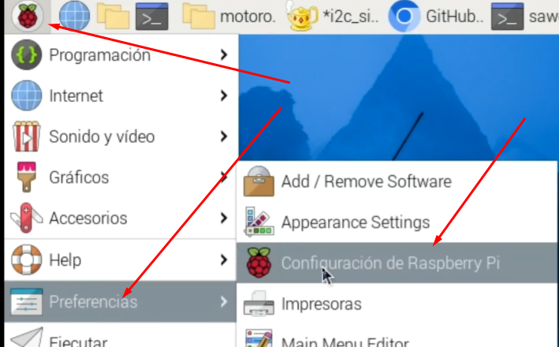
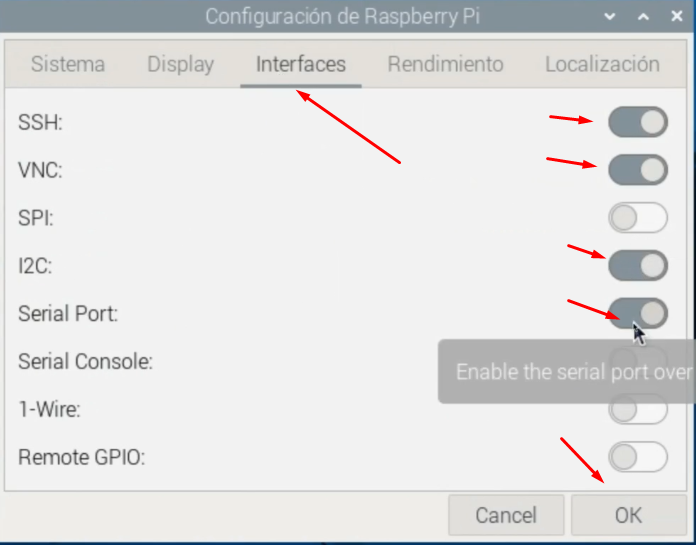
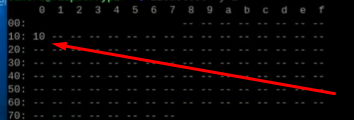

# 🚗 Robot Controlado con Motoron, Motores DC y Raspberry Pi

Este proyecto consiste en la construcción de un pequeño carro robótico controlado mediante una **Raspberry Pi** y el controlador de motores **Motoron** de Pololu. Utiliza motores DC para desplazarse y puede ser programado para moverse de forma autónoma o controlada remotamente.

## 📦 Materiales

- 1 × Raspberry Pi
- 2 × Controlador de motores Motoron
- 4 × Motores DC compatibles con Motoron
- 1 × Chasis para carrito
- 4 × Ruedas compatibles con los motores
- 1 × Batería o fuente de alimentación para motores
- Cables jumper
- Tornillos y sujetadores

<p align="center">
    
</p>


## 🔧 Configuración de la Raspberry Pi para usar Motoron

1. Conexión del Motoron a la Raspberry Pi
Para conectar el controlador Motoron (como el M3H256 o M2H) a la Raspberry Pi, realiza las siguientes conexiones:

- GND: Conectar al pin GND de la Raspberry Pi.
- VIN: Conectar a la fuente de alimentación de los motores.
- M3A/M3B, M2A/M2B: Conectar los motores a estos pines.
- SDA: Conectar al pin GPIO 2 (SDA) de la Raspberry Pi.
- SCL: Conectar al pin GPIO 3 (SCL) de la Raspberry Pi.
- 3V3 o IOREF: Conectar al pin de 3.3V de la Raspberry Pi.

2. Habilitar la interfaz I2C en la Raspberry Pi
- Siga los siguientes pasos:
- Ingrese a la configuración de la Raspberry Pi

<p align="center">
    
</p>

- Verica que las siguientes opciones estén habilitadas.
- Guarde los cambios y reinicie la Raspberry Pi.

<p align="center">
    
</p>

3. Verificar conexión del Motoron:
- Esciba el siguiente comando en el bash
```bash
i2cdetect -y 1
```
<p align="center">
    
</p>

4. Cambiar dirección I2C del Motoron (opcional)

* Preparar el dispositivo:
    - Asegúrate de que el pin JMP1 no esté conectado.
    - Conecta temporalmente JMP1 a GND para seleccionar el dispositivo.
    - Instalar la biblioteca Motoron: (Consulta el repositorio oficial de Pololu)

    - Ejecutar el script de configuración (https://github.com/pololu/motoron-python/blob/master/i2c_set_addresses_example.py):
    ```bash
    python3 set_i2c_addresses_example.py
    ```
    - Por ejemplo, para asignar la dirección 17::
    ```bash
    a17
    ```
    - Desconectar JMP1 de GND y reiniciar: Puedes hacerlo desde el script (r) o reiniciar tu Raspberry Pi.
    -Confirma la dirección asignada
    ```bash
    i2cdetect -y 1
    ```


## 🔗 Enlaces de Referencia

- [Sección 3.2.4 - Uso del Motoron con Raspberry Pi (Configuración I2C)](https://www.pololu.com/docs/0J84/3.2.4)
- [Sección 3.3 - Configuración del software en Raspberry Pi](https://www.pololu.com/docs/0J84/3.3)
- [Sección 3.4 - Código de ejemplo en Python](https://www.pololu.com/docs/0J84/3.4)
- [Página principal del controlador Motoron](https://www.pololu.com/product/5033)
- [Repositorio oficial de pololu-motoron-python](https://github.com/pololu/motoron-python/tree/master)

## ⚙️ Cómo usar

```bash
# Clonar el repositorio
git clone https://github.com/CesarMiranda01/COM520_Robotics_2/tree/main/6.pololu-motoron

# Acceder a proyecto
cd pololu-motoron

# Ejecutar el script
python app.py

```
## 🚗 Resultado
<p align="center">
    
</p>
