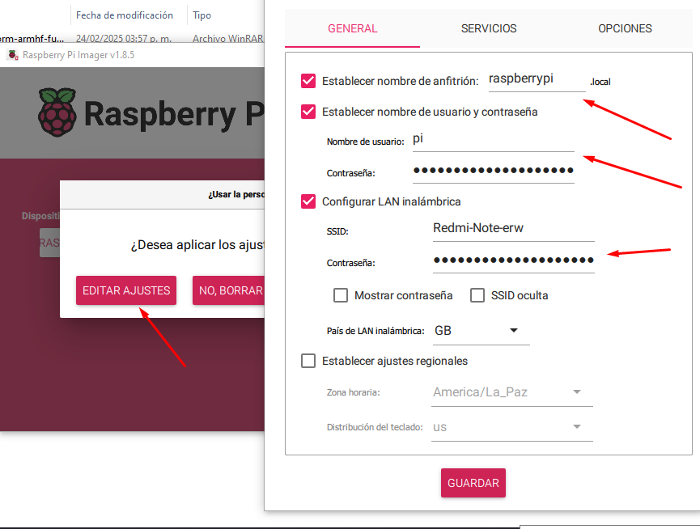
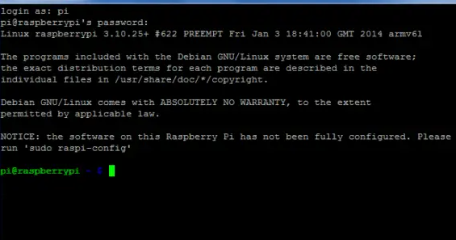
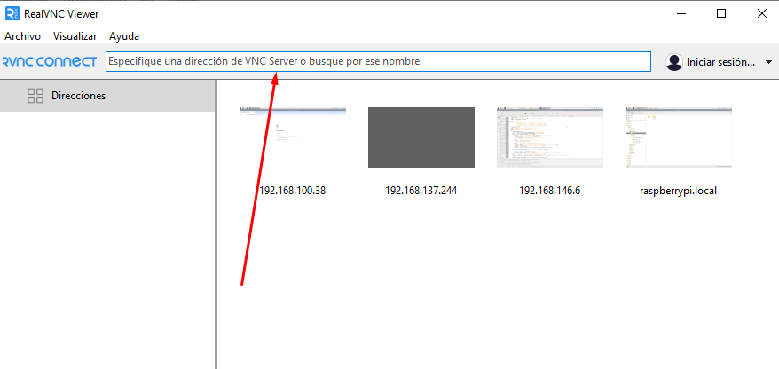
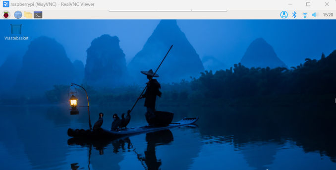
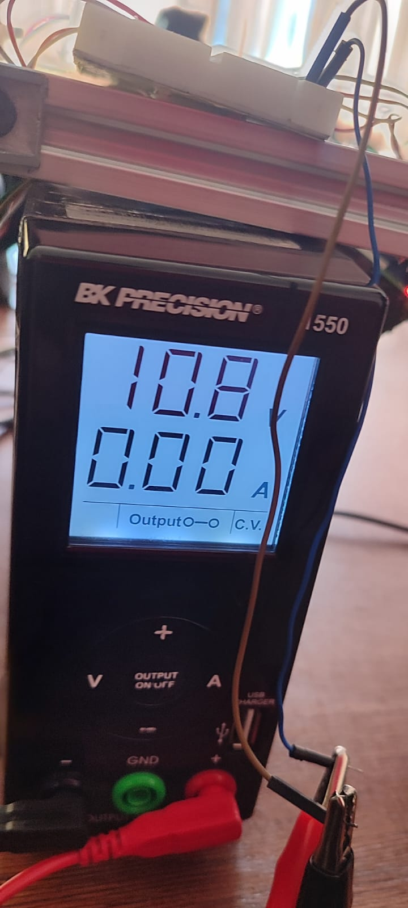
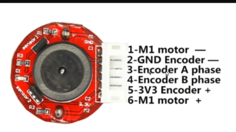
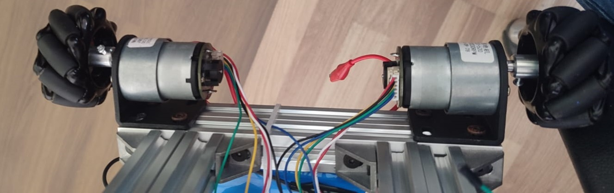
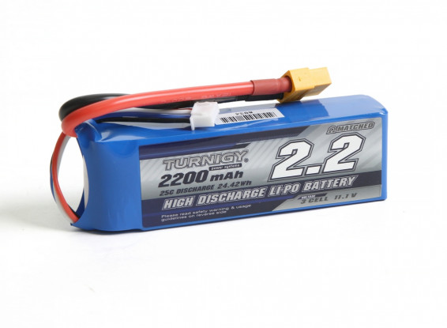
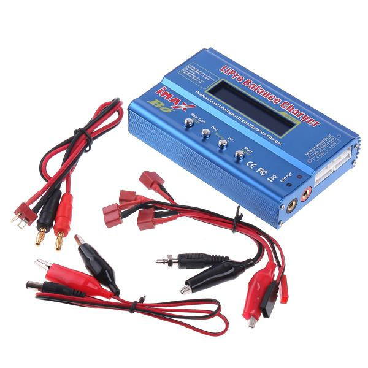
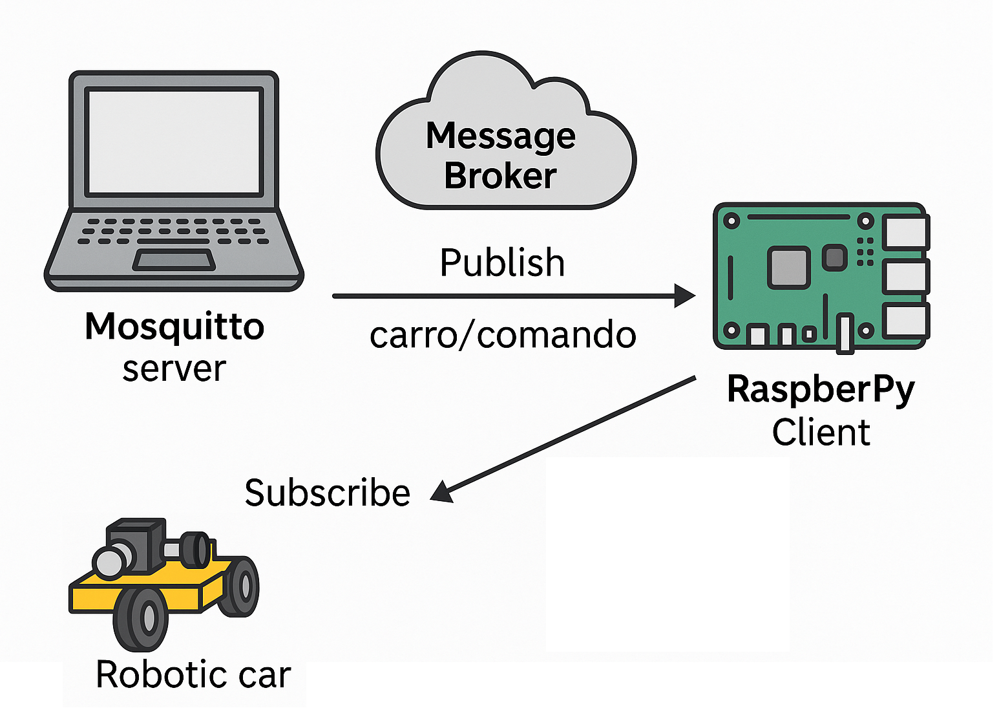

# 🤖 Carro Robótico Modular con Encoders, Energía Independiente y Comunicación MQTT

Este proyecto consiste en el diseño y desarrollo de un carro robótico de 4 motores controlado por una Raspberry Pi. El sistema incluye sensores de encoder para detección de movimiento, fuentes de energía independientes para mejorar la estabilidad eléctrica y comunicación inalámbrica mediante MQTT.

---

### ⚠️ Para realizar la explicación de la construcción lo diviremos en 3 secciones:

---

# 🧩 Sección 1: Instalación de SO en la Raspberry 4

Antes de comenzar con el armado y la configuración, es necesario preparar una tarjeta microSD con el sistema operativo para la Raspberry Pi.

## 📥 Descarga del Sistema Operativo

Puedes descargar el sistema operativo oficial desde la página de Raspberry Pi:

- Raspberry Pi Imager (recomendado): https://www.raspberrypi.com/software/

- Imagen directa de Raspberry Pi OS (64-bit): https://www.raspberrypi.com/software/operating-systems/


#### Selecciona la imagen del sistema
<p align="center">
    
</p>

## 🛠️ Instalación con Raspberry Pi Imager

1. Inserta una microSD (8GB mínimo) en tu PC.
2. Abre Raspberry Pi Imager.

<p align="center">
    
</p>

3. Elige el sistema operativo: "Raspberry Pi 4" y selecciona la imagen ISO.

<p align="center">
    
</p>

<p align="center">
    
</p>

4. Selecciona tu tarjeta microSD.

<p align="center">
    
</p>

5. Editar las configuraciones de conexión.
    - Nombre del anfitrion: raspberry
    - Como usuario: pi
    - Como contraseña: raspberry 
    - Agrega las configuraciones de tu conexión wifi

<p align="center">
    
</p>

5. Haz clic en "Escribir" y espera a que termine.
6. Si deseas acceso remoto, habilita SSH creando un archivo vacío llamado ssh en la partición de arranque.

Una vez listo, coloca la microSD en tu Raspberry Pi.

---

## 🔗 Acceso Remoto con PuTTY y VNC Viewer

Para trabajar de forma remota con la Raspberry Pi desde tu computadora puedes usar herramientas como PuTTY (terminal por SSH) y RealVNC Viewer (interfaz gráfica si usas Raspberry Pi OS con escritorio).

## 📡 Conexión SSH con PuTTY (Windows):

1. Descarga desde: [https://www.putty.org/](https://www.putty.org/)
2. Obtén la IP asignada de la Raspberry Pi (desde tu router).
3. Abre PuTTY e ingresa la IP, puerto 22. (en caso de usar cable ethernet ingresar con el usuario: raspberrypi.local)
4. Haz clic en "Open" y accede con:
5. Usuario: pi
6. Contraseña: raspberry (por defecto, si no fue cambiada)

<p align="center">
    
</p>

## 🖥️ Conexión gráfica con RealVNC Viewer:

- Descarga desde: [https://www.realvnc.com/en/connect/download/viewer/](https://www.realvnc.com/en/connect/download/viewer/)
- Activa VNC en tu Raspberry (si usas entorno gráfico):

``` bash
sudo raspi-config
```
### Interfacing Options > VNC > Enable

Abre VNC Viewer, escribe la IP de la Raspberry y conecta con las mismas credenciales SSH.
Estas herramientas te permitirán gestionar el sistema, subir archivos, o ejecutar código sin necesidad de conectar pantalla y teclado directamente.

<p align="center">
    
</p>

<p align="center">
    
</p>

---

# 🧩 Sección 2: Armado del Carro con Fuente de Poder

### 🔧 Materiales

- 1 × Raspberry Pi
- 2 × Controlador de motores Motoron
- 4 × Motores DC compatibles con Motoron
- 1 × Chasis para carrito
- 4 × Ruedas compatibles con los motores
- 1 × Batería o fuente de alimentación para motores
- Cables jumper
- Tornillos y sujetadores
- 1 × Fuente de alimentación regulada 10V

<p align="center">
    
</p>

<p align="center">
    
</p>

## 🔧 Configuración de la Raspberry Pi para usar Motoron

1. Conexión del Motoron a la Raspberry Pi
Para conectar el controlador Motoron (como el M3H256 o M2H) a la Raspberry Pi, realiza las siguientes conexiones:

- GND: Conectar al pin GND de la Raspberry Pi.
- VIN: Conectar a la fuente de alimentación de los motores.
- M3A/M3B, M2A/M2B: Conectar los motores a estos pines.
- SDA: Conectar al pin GPIO 2 (SDA) de la Raspberry Pi.
- SCL: Conectar al pin GPIO 3 (SCL) de la Raspberry Pi.
- 3V3 o IOREF: Conectar al pin de 3.3V de la Raspberry Pi.

2. Habilitar la interfaz I2C en la Raspberry Pi
- Siga los siguientes pasos:
- Ingrese a la configuración de la Raspberry Pi

<p align="center">
    
</p>

- Verica que las siguientes opciones estén habilitadas.
- Guarde los cambios y reinicie la Raspberry Pi.

<p align="center">
    
</p>

3. Verificar conexión del Motoron:
- Escriba el siguiente comando en el bash
```bash
i2cdetect -y 1
```
<p align="center">
    
</p>

4. Cambiar dirección I2C del Motoron (opcional):

* Preparar el dispositivo:
    - Asegúrate de que el pin JMP1 no esté conectado.
    - Conecta temporalmente JMP1 a GND para seleccionar el dispositivo.
    - Instalar la biblioteca Motoron: (Consulta el repositorio oficial de Pololu)

    - Ejecutar el script de configuración (https://github.com/pololu/motoron-python/blob/master/i2c_set_addresses_example.py):
    ```bash
    python3 set_i2c_addresses_example.py
    ```
    - Por ejemplo, para asignar la dirección 17::
    ```bash
    a17
    ```
    - Desconectar JMP1 de GND y reiniciar: Puedes hacerlo desde el script (r) o reiniciar tu Raspberry Pi.
    -Confirma la dirección asignada
    ```bash
    i2cdetect -y 1
    ```


## 🔗 Enlaces de Referencia

- [Sección 3.2.4 - Uso del Motoron con Raspberry Pi (Configuración I2C)](https://www.pololu.com/docs/0J84/3.2.4)
- [Sección 3.3 - Configuración del software en Raspberry Pi](https://www.pololu.com/docs/0J84/3.3)
- [Sección 3.4 - Código de ejemplo en Python](https://www.pololu.com/docs/0J84/3.4)
- [Página principal del controlador Motoron](https://www.pololu.com/product/5033)
- [Repositorio oficial de pololu-motoron-python](https://github.com/pololu/motoron-python/tree/master)

## ⚙️ Cómo usar

```bash
# Clonar el repositorio
git clone https://github.com/CesarMiranda01/COM520_Robotics_2/tree/main/6.pololu-motoron

# Acceder a proyecto
cd pololu-motoron

# Ejecutar el script
python app.py

```
## 🚗 Resultado
<p align="center">
    
</p>

---

# 🧩 Sección 3: Implementación de Encoders

<p align="center">
    
</p>

### 🎯 Objetivo

Detectar la rotación y velocidad de los motores para tareas de control de movimiento, navegación autónoma o feedback de trayectoria.

### 🔧 Materiales adicionales

* Encoders para motores DC (ópticos o magnéticos)
* Resistencias pull-up (si aplica)
* Conexión a pines GPIO para interrupciones

<p align="center">
    
</p>

### ⚙️ Pasos

1. Conectar salidas de encoder (A/B) a GPIOs configurables como entradas.
2. Activar `RPi.GPIO` en el código Python para leer pulsos.
3. Usar interrupciones para contar pasos.

## Para la prueba del funcionamiento se ejecutaron los sgtes archivos:

### 1. Este archivo se usa para detectar los valores mínimos y máximos de velocidad de cada rueda y obtiene una gráfica del controlador PID
```python
python tuner.py
```

### 2. Este archivo se controla los movimientos de las ruedas en ambos sentidos
```python
python checker.py
```


## 🔗 Enlaces de Referencia
- [https://naylampmechatronics.com/motores-dc/798-motor-dc-jga25-370-12v1000rpm-con-encoder.html](https://naylampmechatronics.com/motores-dc/798-motor-dc-jga25-370-12v1000rpm-con-encoder.html)

---

# 🧩 Sección 4: Implementación de Baterías Individuales + MQTT

<p align="center">
    
    
</p>

### 🎯 Objetivo

Separar la alimentación de la Raspberry Pi y los motores para evitar interferencias eléctricas, caídas de tensión y reinicios inesperados.

### 🔧 Materiales adicionales

* Una batería para la Raspberry Pi (5V, mínimo 2A)
* Otra batería para los motores (10V)
* Asegurar GND común entre ambas fuentes para comunicación adecuada
* 2 Reguladores de tensión.

### Conexiones de todo los componentes
<p align="center">
    
</p>

### 📱 Comunicación MQTT

<p align="center">
    
</p>

Permite control remoto del carro desde una aplicación o servidor.

### 🖥️ Mosquitto en Windows (como servidor):

1. Puedes instalar Mosquitto en tu PC con Windows para que actúe como broker central:
2. Descargar desde: [https://mosquitto.org/download](https://mosquitto.org/download)
3. Ejecutar el instalador y seguir los pasos.
4. Asegúrate de que el puerto 1883 esté abierto en tu red.
5. Inicia Mosquitto con doble clic o desde la terminal con:
6. mosquitto -v
``` bash
mosquitto -v
```


Más información en la documentación oficial: [https://mosquitto.org/](https://mosquitto.org/)

### 🔧 Requisitos

- Servidor MQTT (Mosquitto local o broker externo)
- Biblioteca paho-mqtt para Python:
``` bash
pip install paho-mqtt
```

#### 🧠 Ejecución de código

```python
python mqtt.py
```

---

## 📸 Resultados

<p align="center">
    
</p>

---