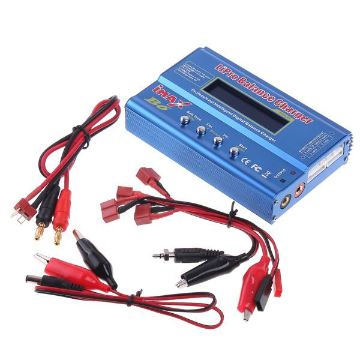

# 🤖 Modular Robotic Car with Encoders, Independent Power, and MQTT Communication

This project involves designing and building a 4-motor robotic car controlled by a Raspberry Pi. The system includes encoder sensors for motion detection, independent power sources to improve electrical stability, and wireless communication using MQTT.

---

### ⚠️ The build explanation is divided into 4 main sections:

---

# 🧩 Section 1: Installing the OS on Raspberry Pi 4

Before starting assembly and configuration, prepare a microSD card with the operating system for the Raspberry Pi.

## 📥 Download the Operating System

You can download the official OS from the Raspberry Pi website:

- Raspberry Pi Imager (recommended): https://www.raspberrypi.com/software/
- Direct Raspberry Pi OS image (64-bit): https://www.raspberrypi.com/software/operating-systems/

#### Select the OS image
<p align="center">
    
</p>

## 🛠️ Installation Using Raspberry Pi Imager

1. Insert a microSD card (minimum 8GB) into your PC.
2. Open Raspberry Pi Imager.

<p align="center">
    
</p>

3. Choose the OS: "Raspberry Pi 4" and select the ISO image.

<p align="center">
    
</p>

<p align="center">
    
</p>

4. Select your microSD card.

<p align="center">
    
</p>

5. Edit connection settings:
   - Hostname: raspberry
   - Username: pi
   - Password: raspberry
   - Add your Wi-Fi settings

<p align="center">
    
</p>

6. Click "Write" and wait for completion.
7. To enable remote access, create an empty file named `ssh` in the boot partition.

Insert the microSD into your Raspberry Pi once ready.

---

## 🔗 Remote Access with PuTTY and VNC Viewer

To work remotely with the Raspberry Pi, you can use PuTTY (SSH terminal) or RealVNC Viewer (graphical interface with desktop).

## 📡 SSH Connection with PuTTY (Windows)

1. Download from: [https://www.putty.org/](https://www.putty.org/)
2. Get the IP assigned to the Raspberry Pi (from your router).
3. Open PuTTY and enter the IP, port 22 (for Ethernet, use `raspberrypi.local` as the host).
4. Click "Open" and log in:
   - Username: pi
   - Password: raspberry (default if not changed)

<p align="center">
    
</p>

## 🖥️ Graphical Connection with RealVNC Viewer

- Download from: [https://www.realvnc.com/en/connect/download/viewer/](https://www.realvnc.com/en/connect/download/viewer/)
- Enable VNC on your Raspberry Pi (if using desktop environment):

```bash
sudo raspi-config
```

### Interfacing Options > VNC > Enable

Open VNC Viewer, enter the Raspberry Pi's IP address, and connect using the same SSH credentials. These tools allow you to manage the system, upload files, and execute code without connecting a monitor or keyboard directly.

<p align="center">
    
</p>

<p align="center">
    
</p>

---

# 🧩 Section 2: Car Assembly with Power Supply

### 🔧 Materials

- 1 × Raspberry Pi
- 2 × Motoron motor controllers
- 4 × DC motors compatible with Motoron
- 1 × Car chassis
- 4 × Wheels compatible with the motors
- 1 × Battery or motor power supply
- Jumper wires
- Screws and fasteners
- 1 × 10V regulated power supply

<p align="center">
    
</p>

<p align="center">
    
</p>

## 🔧 Raspberry Pi Setup for Motoron

1. Connecting Motoron to Raspberry Pi  
For Motoron controllers (M3H256 or M2H), make the following connections:

- GND: Connect to Raspberry Pi GND
- VIN: Connect to motor power supply
- M3A/M3B, M2A/M2B: Connect motors to these pins
- SDA: Connect to GPIO 2 (SDA)
- SCL: Connect to GPIO 3 (SCL)
- 3V3 or IOREF: Connect to Raspberry Pi 3.3V

2. Enable I2C Interface on Raspberry Pi

<p align="center">
    
</p>

- Ensure the relevant options are enabled.
- Save changes and reboot.

<p align="center">
    
</p>

3. Verify Motoron connection:
```bash
i2cdetect -y 1
```
<p align="center">
    
</p>

4. Change Motoron I2C Address (optional):

* Prepare the device:
    - Make sure the JMP1 pin is not connected.
    - Temporarily connect JMP1 to GND to select the device.
    - Install the Motoron library: (Check the official Pololu repository)

    - Run the configuration script (https://github.com/pololu/motoron-python/blob/master/i2c_set_addresses_example.py):
    ```bash
    python3 set_i2c_addresses_example.py
    ```
    - For example, to assign address 17:
    ```bash
    a17
    ```
    - Disconnect JMP1 from GND and restart: You can do this from the script (r) or restart your Raspberry Pi.
    - Confirm the assigned address:
    ```bash
    i2cdetect -y 1
    ```

## 🔗 Reference Links

- [Section 3.2.4 - Using Motoron with Raspberry Pi (I2C Configuration)](https://www.pololu.com/docs/0J84/3.2.4)
- [Section 3.3 - Software Setup on Raspberry Pi](https://www.pololu.com/docs/0J84/3.3)
- [Section 3.4 - Python Example Code](https://www.pololu.com/docs/0J84/3.4)
- [Motoron Controller Main Page](https://www.pololu.com/product/5033)
- [Official pololu-motoron-python Repository](https://github.com/pololu/motoron-python/tree/master)

## ⚙️ How to Use

```bash
# Clone the repository
git clone https://github.com/CesarMiranda01/COM520_Robotics_2/tree/main/6.pololu-motoron

# Access project
cd pololu-motoron

# Run the script
python app.py
```
## 🚗 Result
<p align="center">
    
</p>

---

# 🧩 Section 3: Encoder Implementation

<p align="center">
    
</p>

### 🎯 Objective

Detect motor rotation and speed for motion control tasks, autonomous navigation, or trajectory feedback.

### 🔧 Additional Materials

* Encoders for DC motors (optical or magnetic)
* Pull-up resistors (if applicable)
* Connection to GPIO pins for interrupts

<p align="center">
    
</p>

#### GPIO Installation
```bash
sudo apt-get update
sudo apt-get install python3-rpi.gpio

# or install via pip

pip3 install RPi.GPIO
```

### ⚙️ Steps

1. Connect encoder outputs (A/B) to GPIOs configurable as inputs.
2. Enable `RPi.GPIO` in Python code to read pulses.
3. Use interrupts to count steps.

## For functionality testing, the following files were executed:

### Install matplotlib library
```bash
pip install matplotlib
```

### 1. This file detects min/max speed values for each wheel and generates a PID controller graph
```python
python tuner.py
```

### 2. This file controls wheel movements in both directions
```python
python motor_cheker.py
```

## 🔗 Reference Links
- [https://naylampmechatronics.com/motores-dc/798-motor-dc-jga25-370-12v1000rpm-con-encoder.html](https://naylampmechatronics.com/motores-dc/798-motor-dc-jga25-370-12v1000rpm-con-encoder.html)

---

# 🧩 Section 4: Individual Batteries + MQTT Implementation

<p align="center">
    
    
</p>

### 🎯 Objetive

Separate power supply for Raspberry Pi and motors to avoid electrical interference, voltage drops, and unexpected reboots.

### 🔧 Additional Materials

* One battery for Raspberry Pi (5V, minimum 2A)
* Another battery for motors (10V)
* Ensure common GND between both power sources for proper communication
* 2 Voltage regulators

### All component connections:
<p align="center">
    
</p>

### 📱 MQTT Communication

<p align="center">
    
</p>

Allows remote control of the car from an application or server.

### 🖥️ Mosquitto on Windows (as server):

1. Install Mosquitto on your Windows PC to act as central broker:
2. Download from: [https://mosquitto.org/download](https://mosquitto.org/download)
3. Run the installer and follow the steps.
4. Make sure port 1883 is open on your network.
5. Start Mosquitto by double-clicking or from terminal:
```bash
mosquitto -v
```


More information in official documentation: [https://mosquitto.org/](https://mosquitto.org/)


### 🔧 Requirements

- MQTT server (local Mosquitto or external broker)
- paho-mqtt library for Python:
```bash
pip install paho-mqtt
```


#### GPIO Installation
```bash
sudo apt-get update
sudo apt-get install python3-rpi.gpio

# or install via pip

pip3 install RPi.GPIO
```

#### 🧠 Server code execution

```python
python mqtt_server.py
```

#### 🧠  Client code execution

```python
python mqtt_client.py
```

# Results section
# <p align="center"> </p>